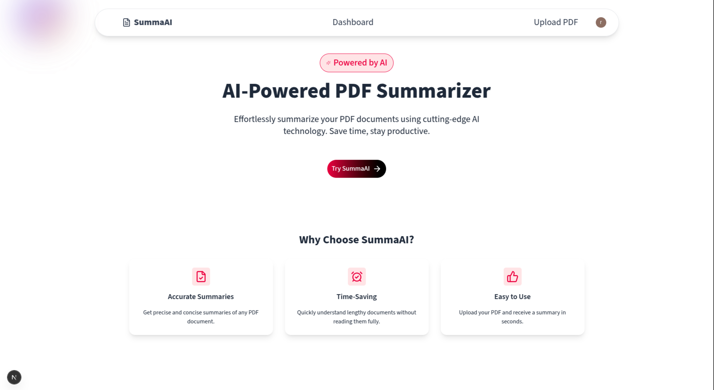
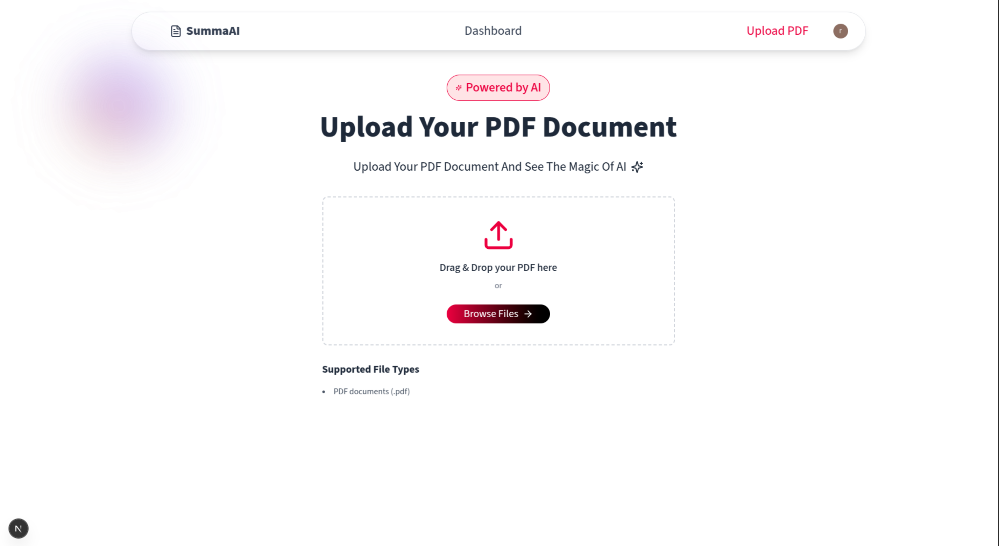
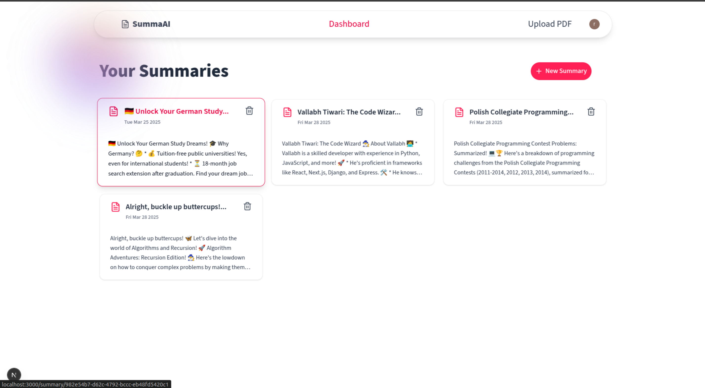
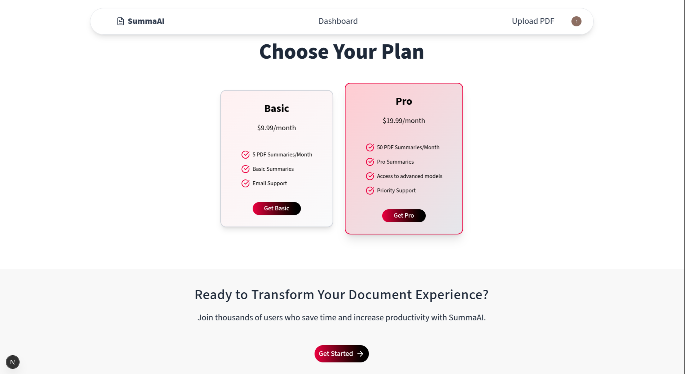

# SummaAI - PDF Summarizing SaaS

## 🚀 Overview

SummaAI is a powerful web application that allows users to quickly generate concise summaries of PDF documents using AI. Built with modern technologies, it provides a seamless experience for users looking to extract key insights from lengthy PDFs.

## 🛠 Tech Stack

- **Next.js** – For a fast and efficient frontend and backend framework.
- **Clerk** – Handles user authentication seamlessly.
- **LangChain** – Manages AI-powered processing of PDF content.
- **Gemini** – Provides advanced language models for accurate summarization.
- **Stripe** – Enables secure payments and subscription management.

## ✨ Features

- 📄 Upload PDFs and receive AI-generated summaries instantly.
- 🔒 Secure authentication with Clerk.
- 🎯 Accurate summarization using LangChain and Gemini AI.
- 💳 Subscription-based model with Stripe integration.
- 📊 User-friendly dashboard for managing summaries.
- 🌐 Responsive design for desktop and mobile.

## 📸 Screenshots


**Landing Page** – A sleek and inviting homepage.


**Upload Page** – Upload your PDF document.


**Dashboard** – View and manage all your summaries.


**Summary Page** – Display AI-generated PDF summaries.


**Plans Page** – Choose basic or pro plan.

## 📦 Installation & Setup

1. Clone the repository:
   ```sh
   git clone https://github.com/vallabhtiwari/summaai.git
   cd summaai
   ```
2. Install dependencies:
   ```sh
   npm install
   ```
3. Set up environment variables:
   ```sh
   cp .env.example .env
   ```
   Update the `.env` file with the necessary API keys.
4. Start the development server:
   ```sh
   npm run dev
   ```
